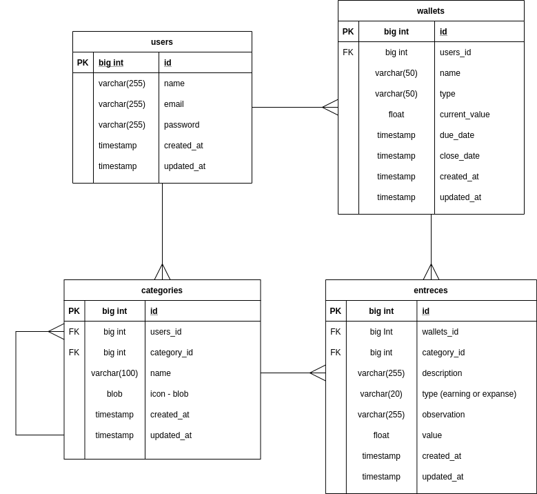

# My Wallet BackEnd Project (Laravel 8.*)

System to control finnaces and stock portifolio

## Todo

- [x] Create laravel project
- [x] [Add Jwt Autentication](https://codezen.io/laravel-7-rest-api-using-jwt-authentication/)
- [x] Add DER Model
- [x] [Add Laravel Schematics](https://github.com/mtolhuys/laravel-schematics)
- [x] Create Migrations
- [x] Create Models
- [x] Create Relationship Functions
- [ ] Create Controllers
  - [x] Add Files
  - [ ] Implement methods
    - [x] JWTAuthController
    - [ ] UserController
    - [ ] WalletController
    - [ ] EntraceController
    - [ ] CategoryController
- [ ] Add Postman documentation
  - [x] JWTAuthController
  - [ ] UserController
  - [ ] WalletController
  - [ ] EntraceController
  - [ ] CategoryController
- [ ] [Add Laravel LogViewer](https://aristides.dev/instalando-logviewer-no-laravel-56/)
- [ ] [Deploy heroku](https://devcenter.heroku.com/articles/getting-started-with-laravel)

## DER

